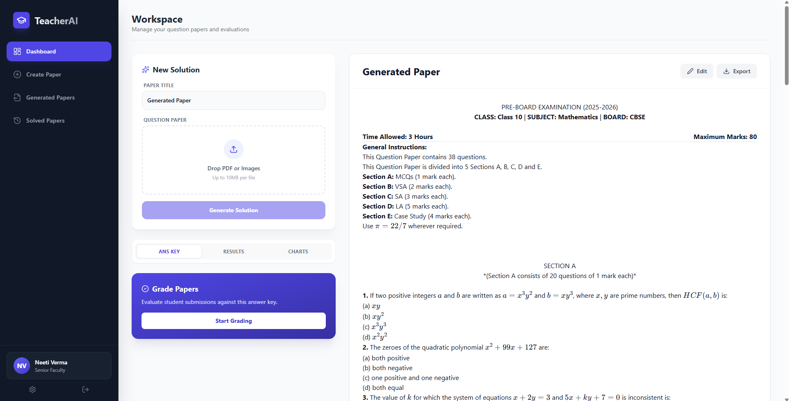

# TeacherAssistant AI

TeacherAssistant is an AI-powered application designed to streamline the workflow of educators. It leverages multimodal LLMs (Google Gemini) to automatically solve question papers, generate new exams based on board standards (CBSE/ICSE/IB), and evaluate student handwritten submissions with detailed feedback.



## 🌟 Capabilities

### 1. Paper Solver
- **Instant Solutions**: Upload PDF question papers or images.
- **Multimodal AI**: The app reads the questions directly from the images.
- **Export**: Solutions are saved as Markdown for easy distribution and accurate Math Rendering.

### 2. 📄 Exam Paper Generator
- **Custom Papers**: Generate simplified or complex papers based on:
    - **Class Level** (e.g., Class 10)
    - **Subject** (Math, Science, etc.)
    - **Board** (CBSE, ICSE, IB) - Enforces board-specific formatting and headers.
    - **Chapters**: Select specific syllabus areas.
    - **Difficulty**: Adjustable difficulty slider.

### 3. 👩‍🏫 Student Checker (Auto-Grader)
- **AI Evaluation**: Upload a student's answer sheet (PDF/Images) and a reference solution.
- **Grade & Feedback**: The AI compares the handwritten answers against the key.
- **Report Generation**: Produces a tabular report with question-wise marks and feedback.

### 4. 💻 Cross-Platform Support
- **Web**: Responsive React application.
- **Desktop**: Fully functional Windows application (Electron).
- **Mobile**: Android support (Capacitor).

---

## 🛠️ Tech Stack

### Frontend
- **Framework**: React.js (Vite)
- **Styling**: Tailwind CSS
- **Desktop Wrapper**: Electron (Squirrel.Windows for installers)
- **Mobile Wrapper**: Capacitor (Android)
- **State Management**: React Hooks & Context

### Backend
- **Server**: FastAPI (Python)
- **AI Model**: Google Gemini (`gemini-3-flash-preview`)
- **Database & Storage**: Supabase (PostgreSQL + Object Storage)
- **PDF Processing**: `pypdfium2`

---

## 🚀 Installation & Setup

### Prerequisites
- **Node.js** (v18+)
- **Python** (v3.10+)
- **Supabase Account**: You need a project with a database and storage bucket named `papers`.
- **Google AI Studio Key**: API Key for Gemini.

### 1. Backend Setup (`/backend`)

1. Navigate to the backend folder:
   ```bash
   cd backend
   ```
2. Create and activate a virtual environment:
   ```bash
   python -m venv venv
   # Windows
   .\venv\Scripts\activate
   # Mac/Linux
   source venv/bin/activate
   ```
3. Install dependencies:
   ```bash
   pip install -r requirements.txt
   ```
4. Configure Environment Variables:
   Create a `.env` file in `backend/` with:
   ```env
   GEMINI_API_KEY=your_gemini_key
   SUPABASE_URL=your_supabase_url
   SUPABASE_KEY=your_supabase_service_role_key
   ```
5. Run the Server:
   ```bash
   fastapi dev main.py
   ```
   Server will run at `http://127.0.0.1:8000`.

### 2. Frontend Setup (`/frontend`)

1. Navigate to the frontend folder:
   ```bash
   cd frontend
   ```
2. Install dependencies:
   ```bash
   npm install
   ```
3. Configure Environment Variables:
   Create a `.env` file in `frontend/` (if running locally against local backend):
   ```env
   VITE_API_BASE_URL=http://127.0.0.1:8000
   ```
   *(For production/desktop, use your deployed backend URL)*

### 3. Run Locally (Web)
```bash
npm run dev
```

---

## 📦 Building Applications

### 🖥️ Windows Desktop App (Electron)

To create a standalone `.exe` installer:

1. Ensure you are in the `frontend` directory.
2. Build the React app and package it:
   ```bash
   npm run make
   ```
3. **Output**:
   - **Installer**: `out/make/squirrel.windows/x64/TeacherAssistant-...Setup.exe`
   - **Portable**: `out/make/zip/win32/x64/TeacherAssistant-....zip`

### 📱 Android App (Capacitor)

1. Ensure the backend is deployed (Android cannot access `localhost` easily). Update `.env` with the public URL.
2. Build the frontend:
   ```bash
   npm run build
   ```
3. Sync with Android project:
   ```bash
   npx cap sync
   ```
4. Open in Android Studio:
   ```bash
   npx cap open android
   ```
5. Run the app on an emulator or connected device via Android Studio.
